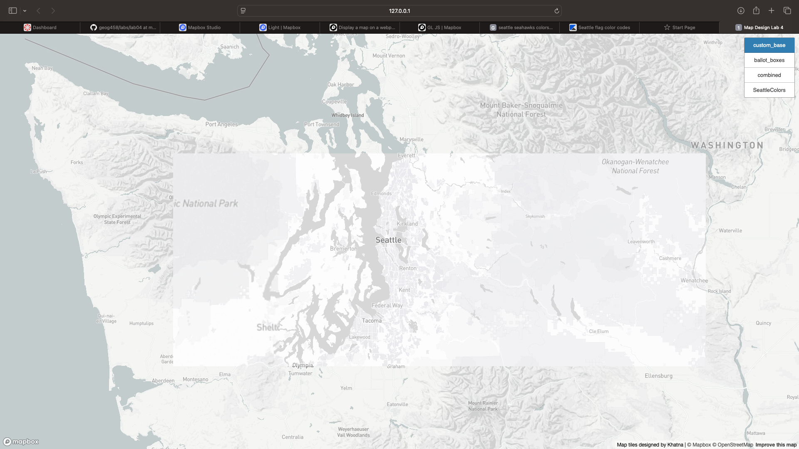
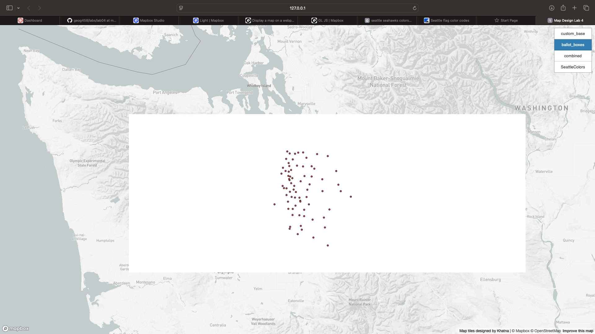
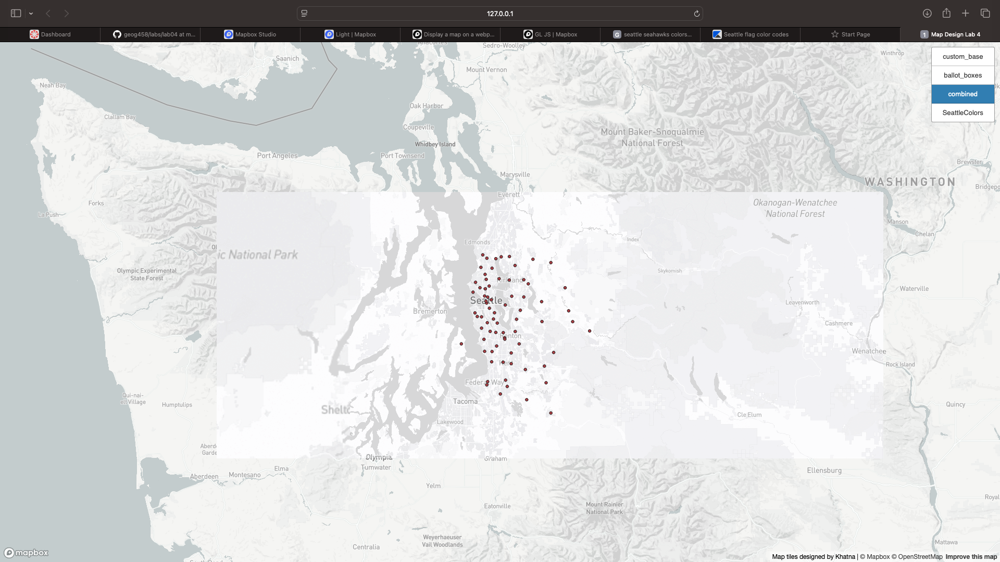
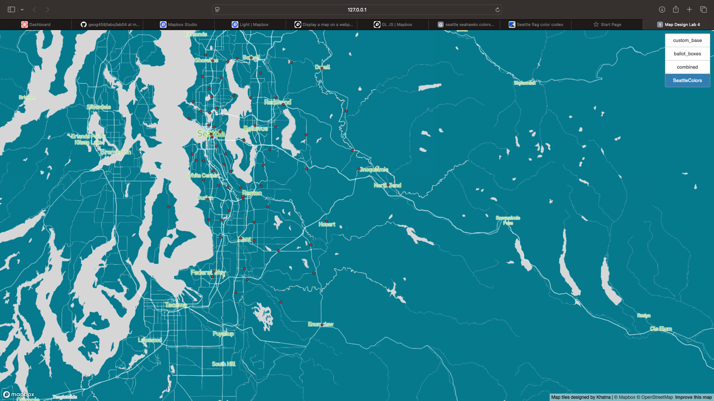

# tileset

### Khatanbaatar Bayaraa

# Topic: Map Design & Tile Generation

## The chosen geographic area and zoom levels

For this project, The King County, WA, USA was chosen. The available zoom levels for the tiles are 8 - 13. Unnecessary polygons were removed. The index html file was done based on the given example in lab 4. 

>[The link for the map](index.html)

### The Tile Set 1

The base tileset shows the King County area in Washington state

### The Tile Set 2

The theme tile set represents all the ballot dropboxes in the King County area.

### The Tile Set 3

This tileset combines the tileset 1 and tileset 2.

### The Tile Set 4

This tileset shows all the ballot dropboxes in the King County area. Since the information the map providing is related to WA, the state and Seattle colorways were chosen for style of the map.